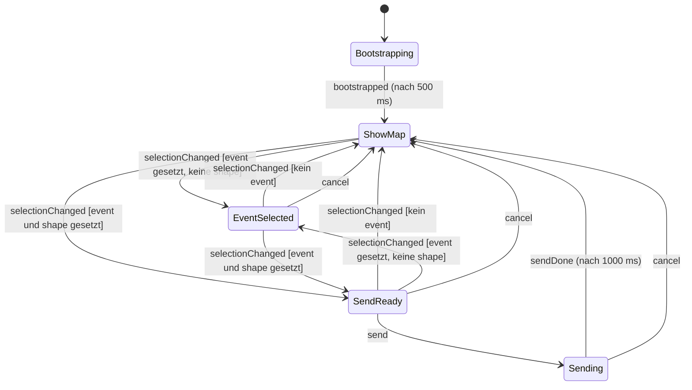

# Zustandsautomat (`src/fsm.ts`)

Der Automat `selection` steuert, welche Bedienelemente sichtbar bzw. aktiv sind. Das Feld „Zustand“ in der Oberfläche zeigt den aktuellen Zustand an. Er ist mit [machina](https://github.com/machinajs/machina) umgesetzt.

## Zustandsdiagramm

## Zustände

| Zustand | Bedeutung | Enter/Exit |
|---|---|---|
| `Bootstrapping` | Startzustand, simuliert die Abfrage von Hintergrunddiensten | Enter: Timer 500 ms → `bootstrapped`; Exit: Timer wird gelöscht |
| `ShowMap` | Karte wird angezeigt, es ist kein Ereignis gewählt | – |
| `EventSelected` | Ereignis gewählt, aber noch keine Form | – |
| `SendReady` | Ereignis und Form gewählt, Senden möglich | – |
| `Sending` | Senden läuft (Spinner), danach automatischer Reset | Enter: Timer 1000 ms → `sendDone`; Exit: Timer wird gelöscht |

## Wirkung auf die Oberfläche

`render()` in `src/main.ts` setzt nach jedem Zustandswechsel:

| Zustand | Spinner | Formen wählbar | Abbrechen | OK | „Bearbeiten“ | Textfeld rechts |
|---|---|---|---|---|---|---|
| `Bootstrapping` | ja | nein | nein | nein | nein | nein |
| `ShowMap` | nein | nein | nein | nein | nein | nein |
| `EventSelected` | nein | ja | ja | nein | nein | nein |
| `SendReady` | nein | ja | ja | ja | sichtbar | per „Bearbeiten“ ein-/ausblendbar (startet ausgeblendet) |
| `Sending` | ja | nein | ja | nein | nein | nein |

Beim Eintritt in `ShowMap` werden Menü, Karte und Textfeld zurückgesetzt; beim Eintritt in `Sending` wird der Text per `console.log` ausgegeben. Abbrechen (Button oder Esc) fragt vorher „Wirklich abbrechen?“.

## Ereignisse

| Ereignis | Wirkt in | Ergebnis |
|---|---|---|
| `bootstrapped` | `Bootstrapping` | → `ShowMap` |
| `selectionChanged` | `ShowMap`, `EventSelected`, `SendReady` | Zielzustand wird aus der Auswahl berechnet (siehe unten) |
| `send` | `SendReady` | → `Sending` |
| `sendDone` | `Sending` | → `ShowMap` |
| `cancel` | `EventSelected`, `SendReady`, `Sending` | → `ShowMap` |

## Zustand aus der Auswahl (`stateFor`)

`selectionChanged` übergibt die aktuelle `Selection` (`{ event, shape }`). Der Zielzustand ergibt sich so:

| `event` | `shape` | Zustand |
|---|---|---|
| leer | egal | `ShowMap` |
| gesetzt | leer | `EventSelected` |
| gesetzt | gesetzt | `SendReady` |

Entspricht der berechnete Zustand dem aktuellen, findet keine Transition statt.

Die Oberfläche lässt „Form ohne Ereignis“ gar nicht erst zu: Formen sind erst ab `EventSelected` wählbar, und beim Abwählen des Ereignisses wird die Form mit zurückgesetzt. Der Übergang `ShowMap → SendReady` ist daher im Normalbetrieb nicht erreichbar, bleibt aber in der FSM-Logik erhalten.

## Hinweise

- In `Bootstrapping` und `Sending` wird `selectionChanged` ignoriert.
- `Sending` kann per `cancel` vorzeitig verlassen werden; der Reset-Timer wird dabei über `_onExit` gelöscht.
